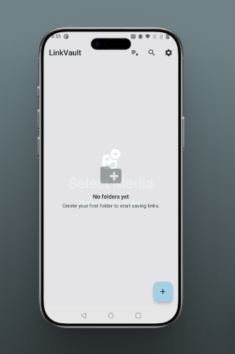
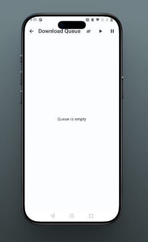
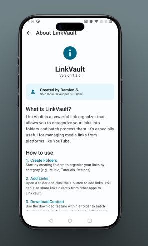
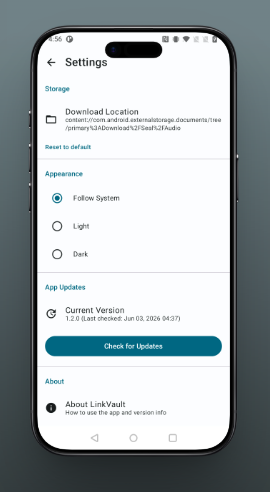

# LinkVault

A personal media vault for Android. Organize your links into folders, download audio and video directly to your device, and own your media library without subscriptions, accounts, or cloud dependency.

---

## What It Does

LinkVault lets you save, organize, and download media links in one place. Share a link from YouTube directly into the app, have it automatically named and sorted into a folder, download it as a properly tagged MP3 with embedded album art, and search your entire collection by artist or song name — all from your phone, fully offline after downloading.

No account. No subscription. No algorithm. Just your library, the way you built it.

---

## Features

### Link Organization
- Organize links into custom folders however you want
- Share any YouTube link directly into LinkVault from the Android share sheet
- App automatically scrapes the video title, artist, and song name to name the link on import
- Manually rename any link if the auto-name is not right

### Built-in Downloader
- yt-dlp powered downloader built directly into the app
- Full download queue — line up multiple downloads and let them run in the background
- No jumping between apps or pasting into third-party websites

### Audio Metadata & Album Art
- Scrapes thumbnail from YouTube and embeds it as album art in the MP3
- Scrapes artist name and song title and embeds them as ID3 metadata tags
- Downloaded files show up properly in every music player with correct artwork and info — because the tags are actually there

### Import / Export
- Export any folder as a ZIP file containing all its links
- Share that ZIP with anyone — they can import it straight into their own LinkVault
- Full collection portability, no account linking required

### Search
- Search by artist name, song title, or keyword from the main screen
- Results show every folder containing a matching link
- No digging through folders trying to remember where something is

---

## Screenshots

  
  
  
  

---

## Installation

LinkVault is not on the Google Play Store. You install it by sideloading the APK.

**1. Download the APK**

Go to the [Releases](#releases) section below and download the APK that matches your device.

**2. Enable unknown sources on your device**

- Android 8 and above: **Settings → Apps → Special App Access → Install Unknown Apps** → select your browser or file manager and enable it
- Older Android: **Settings → Security → Unknown Sources**

**3. Open the APK and tap Install**

No account, no setup, no permissions you did not agree to.

---

## Releases

All architectures are included in each release. Head to the [latest release](https://github.com/DamienSmith428/LinkVault/releases/latest) and download the APK that matches your device:

| Architecture | Device Type |
|---|---|
| arm64-v8a | Most phones 2016 and newer — **use this if unsure** |
| armeabi-v7a | Older or budget 32-bit Android devices |
| x86_64 | Android emulators and Intel-based Android devices (64-bit) |
| x86 | Older 32-bit Android emulators and Intel devices |

---

## Permissions

LinkVault requests only the permissions it actually needs:

| Permission | Reason |
|---|---|
| Internet | Downloading media and scraping metadata |
| Read/Write Storage | Saving downloaded files to your device |
| Foreground Service | Keeping downloads running while the app is in the background |

No contacts, no location, no microphone, no camera.

---

## Privacy

LinkVault does not collect, transmit, or store any personal data. Everything stays on your device. No analytics, no crash reporting, no telemetry of any kind. The only network activity is what you directly trigger — downloading a link or scraping metadata from it.

---

## Who This Is For

- People who want to own their music instead of streaming it
- Anyone who curates playlists and wants to keep them permanently
- People who share curated link collections with friends
- The self-hosting and indie Android community
- Anyone tired of paying monthly for music they used to own outright

---

## Disclaimer

This app is intended for personal use. You are responsible for complying with the terms of service of any platform you interact with and with applicable copyright law in your region. The developer is not responsible for how you use this tool.

---

## Contributing

This is a personal project shared with the community. If you find a bug or have a feature idea, open an issue and I will take a look when I can.

---

## License

MIT License. See [LICENSE](LICENSE) for details.
